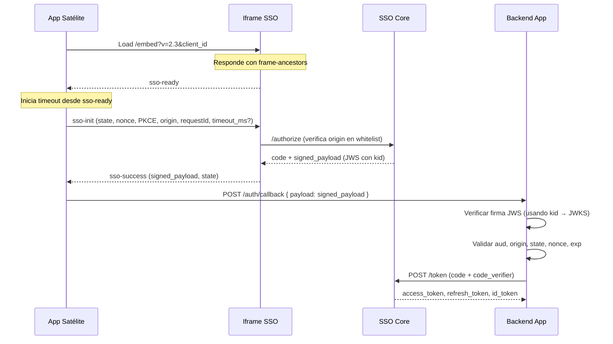

# 🔐 Estándar de Comunicación Segura SSO v2.3 (Iframe ↔ App Satélite)

> Evolución de v2.2 con correcciones críticas de seguridad: whitelist de origins explícita, frame-ancestors, kid en JWS, validación de nonce en backend, timeout reactivo y negociación de versión.

---

# 🧠 Objetivo

Definir un protocolo seguro, extensible y versionado para:

- Autenticación vía iframe
- Transporte seguro de `authorization_code`
- Validación fuerte con PKCE + JWS
- Compatibilidad multi-app / multi-tenant

---

# 📋 Cambios respecto a v2.2

| # | Severidad | Cambio |
|---|-----------|--------|
| 1 | Crítico | Whitelist de origins explícita y obligatoria en el SSO Core |
| 2 | Crítico | Header `Content-Security-Policy: frame-ancestors` requerido en `/embed` |
| 3 | Alto | Header JWS debe incluir `kid` para soporte correcto de rotación de claves |
| 4 | Alto | Timeout reactivo: inicia después de `sso-ready`, configurable vía `sso-init` |
| 5 | Medio | `nonce` añadido como campo obligatorio en la validación de backend (sección 8) |
| 6 | Medio | Error `version_mismatch` definido para incompatibilidad de versiones |
| 7 | Menor | `redirect_uri` requiere validación exacta contra URIs registradas por `client_id` |
| 8 | Menor | Diagrama de flujo corregido: validación JWS explícita antes del intercambio de code |

---

# 🧩 Flujo General



---

# 🧩 1. Inicialización del iframe

```
https://sso.bigso.co/embed?v=2.3&client_id=abc123
```

**Headers de respuesta obligatorios:**

```http
Content-Security-Policy: frame-ancestors 'self' https://app.bigso.co https://admin.bigso.co
X-Frame-Options: ALLOWFROM https://app.bigso.co
```

> ⚠️ El SSO Core mantiene la whitelist de origins autorizados por `client_id`. Si el origen que embebe el iframe no está registrado para ese `client_id`, el servidor debe devolver `403` antes de renderizar el iframe.

---

# 🧩 2. Contrato Base de Mensajes

```ts
interface SSOMessageBase {
  v: "2.3";
  source: "@bigso/sso-iframe" | "@app/widget";
  type: string;
  requestId: string; // obligatorio
}
```

> El iframe debe rechazar cualquier mensaje donde `event.origin` no esté en la whitelist de origins registrados para el `client_id` activo. Esta validación es **obligatoria**, no recomendada.

---

# 🧩 3. Handshake

## 3.1 sso-ready

```json
{
  "v": "2.3",
  "source": "@bigso/sso-iframe",
  "type": "sso-ready",
  "requestId": "init"
}
```

> La app **debe** iniciar el timeout únicamente después de recibir este evento, no al cargar el iframe.

---

## 3.2 sso-init (App → Iframe)

```ts
interface SSOInitMessage {
  v: "2.3";
  source: "@app/widget";
  type: "sso-init";
  requestId: string;
  payload: {
    state: string;           // obligatorio
    nonce: string;           // obligatorio — almacenar en la app para validación posterior
    code_challenge: string;  // obligatorio
    code_challenge_method: "S256";
    origin: string;          // obligatorio — debe estar en whitelist del client_id
    redirect_uri?: string;   // si se envía, debe coincidir exactamente con URI registrada
    tenant_hint?: string;
    timeout_ms?: number;     // opcional — override del timeout de fallback (default: 5000)
  };
}
```

> Si `redirect_uri` está presente, el SSO Core debe validar que coincida exactamente (sin normalización ni wildcard) con una URI registrada para ese `client_id`. Un mismatch debe producir `sso-error` con `code: "invalid_request"`.

---

## 3.3 sso-success (Iframe → App)

```ts
interface SSOMessageSuccess {
  v: "2.3";
  source: "@bigso/sso-iframe";
  type: "sso-success";
  requestId: string;
  payload: {
    signed_payload: string; // JWS compacto (header.payload.signature)
    state: string;          // la app debe verificar que coincide con el enviado en sso-init
  };
}
```

---

## 3.4 sso-error

```ts
interface SSOMessageError {
  v: "2.3";
  source: "@bigso/sso-iframe";
  type: "sso-error";
  requestId: string;
  payload: {
    code:
      | "login_required"
      | "network_error"
      | "invalid_request"
      | "version_mismatch"  // nuevo en v2.3
      | "origin_not_allowed"; // nuevo en v2.3
    message?: string;
    expected_version?: string; // presente cuando code === "version_mismatch"
  };
}
```

### Manejo de version_mismatch

Si el iframe recibe un mensaje con `v` distinto a `"2.3"`, debe responder con:

```json
{
  "v": "2.3",
  "source": "@bigso/sso-iframe",
  "type": "sso-error",
  "requestId": "<requestId del mensaje recibido>",
  "payload": {
    "code": "version_mismatch",
    "message": "Version 2.1 not supported. Expected 2.3.",
    "expected_version": "2.3"
  }
}
```

La app satélite debe tratar `version_mismatch` como error fatal y activar el fallback a redirección.

---

# 🔐 4. signed_payload (JWS)

## 4.1 Header JWS

```json
{
  "alg": "RS256",
  "typ": "JWT",
  "kid": "sso-key-2024-01"
}
```

> `kid` es **obligatorio** en v2.3. Permite que el backend seleccione la clave correcta del JWKS sin intentar validar con todas las claves activas. Facilita la rotación de claves sin downtime.

## 4.2 Payload JWS

```json
{
  "iss": "https://sso.bigso.co",
  "aud": "https://app.bigso.co",
  "origin": "https://app.bigso.co",
  "iat": 1710000000,
  "exp": 1710000060,
  "state": "...",
  "nonce": "...",
  "code": "auth_code_single_use",
  "tenant": "tenant_id",
  "jti": "unique-token-id"   // recomendado para prevención de replay
}
```

---

# 🔐 5. Reglas de Seguridad

## Obligatorio

- Validar `event.origin` contra whitelist registrada para el `client_id` (no solo formato)
- Rechazar mensajes con `origin` no registrado con `code: "origin_not_allowed"`
- Validar `state` (comparación exacta, tiempo constante)
- Validar firma JWS en backend usando `kid` → JWKS
- Validar `nonce` en backend (comparar con el enviado en `sso-init`) ← **nuevo en v2.3**
- PKCE con `code_challenge_method: S256`
- `requestId` correlacionado
- Código de un solo uso (marcar como usado al recibir, rechazar reintentos)
- Header `frame-ancestors` en `/embed` ← **nuevo en v2.3**
- `kid` presente en header JWS ← **nuevo en v2.3**

## Recomendado

- Validación JWS también en frontend (soft — no sustituye la del backend)
- TTL del code: 30–60s
- Rotación de claves (JWKS) — facilitada por `kid`
- `jti` en el payload JWS + registro de tokens usados (prevención de replay)
- Rate limiting por `client_id` en `/authorize`

---

# 🔁 6. Callback Seguro (Backend)

❌ NO usar query string

```http
POST /auth/callback
Content-Type: application/json
Authorization: Bearer <session_token_de_la_app>
```

```json
{
  "payload": "<signed_payload_jws>"
}
```

El backend extrae el `code` del JWS **después** de verificar la firma, nunca antes.

---

# ⏱️ 7. Timeout y Fallback

El timeout debe iniciar **después de recibir `sso-ready`**, no al cargar el iframe.

```js
let authCompleted = false;

iframe.contentWindow.addEventListener('message', (event) => {
  // Validar origin contra whitelist antes de procesar
  if (!ALLOWED_ORIGINS.includes(event.origin)) return;

  const msg = event.data;
  if (msg.type === 'sso-ready') {
    // Iniciar timeout reactivo — no hardcodeado al load del iframe
    const timeoutMs = config.ssoTimeoutMs ?? 5000;
    setTimeout(() => {
      if (!authCompleted) {
        window.location.href = buildSSORedirectURL();
      }
    }, timeoutMs);

    // Enviar sso-init
    sendInit();
  }

  if (msg.type === 'sso-success') {
    authCompleted = true;
    handleSuccess(msg.payload);
  }

  if (msg.type === 'sso-error') {
    if (msg.payload.code === 'version_mismatch') {
      // Error fatal — no reintentar con iframe
      window.location.href = buildSSORedirectURL();
    }
    handleError(msg.payload);
  }
});
```

---

# 🔑 8. Validación en Backend

Orden de validación obligatorio:

1. Decodificar header JWS (sin verificar) → obtener `kid`
2. Resolver `kid` contra JWKS (`/.well-known/jwks.json`)
3. Verificar firma JWS con la clave obtenida
4. Validar `iss` = `https://sso.bigso.co`
5. Validar `aud` = origin esperado de la app
6. Validar `origin` = origin registrado para el `client_id`
7. Validar `state` = valor enviado en `sso-init` (comparación en tiempo constante)
8. Validar `nonce` = valor enviado en `sso-init` ← **nuevo en v2.3**
9. Validar `exp` (no expirado)
10. Verificar que el `code` no haya sido usado previamente
11. Intercambiar `code` con PKCE (`code_verifier`) → `/token`

> Si cualquier paso falla, retornar `401` sin detalles en el body (no revelar qué campo falló).

---

# 🔐 9. Publicación de claves

```
GET /.well-known/jwks.json
```

Respuesta esperada:

```json
{
  "keys": [
    {
      "kty": "RSA",
      "use": "sig",
      "alg": "RS256",
      "kid": "sso-key-2024-01",
      "n": "...",
      "e": "AQAB"
    }
  ]
}
```

> Durante rotación de claves, publicar la nueva clave en JWKS **antes** de comenzar a firmar con ella. Mantener la clave anterior activa durante al menos el TTL máximo de un code (60s) para permitir validaciones en vuelo.

---

# 🧠 10. Registro de Origins (SSO Core)

Cada `client_id` registrado debe tener una lista de origins autorizados:

```json
{
  "client_id": "abc123",
  "allowed_origins": [
    "https://app.bigso.co",
    "https://admin.bigso.co"
  ],
  "allowed_redirect_uris": [
    "https://app.bigso.co/auth/callback",
    "https://admin.bigso.co/auth/callback"
  ]
}
```

El SSO Core debe rechazar con `403` cualquier request a `/embed` cuyo `Referer` o `Origin` no esté en `allowed_origins` para el `client_id` provisto.

---

# 🧩 11. Consideraciones de Diseño

- El iframe es canal de transporte, no de sesión
- El SSO es stateless respecto al frontend
- Cada app mantiene su sesión
- El protocolo es extensible: device binding, silent auth, step-up authentication
- La whitelist de origins es la primera línea de defensa — todas las demás validaciones asumen que el mensaje proviene de un origin legítimo

---

# 🧨 Conclusión

v2.3 establece:

- **Seguridad de embedding**: `frame-ancestors` previene uso del iframe en contextos no autorizados
- **Origin binding fuerte**: whitelist explícita obligatoria, no opcional
- **Rotación de claves sin fricción**: `kid` en header JWS permite selección directa
- **Validación completa de nonce**: cierra la brecha de replay en la cadena backend
- **Protocolo self-describing**: `version_mismatch` permite detectar incompatibilidades en tiempo real
- **Timeout operacionalmente correcto**: reactivo a `sso-ready`, configurable por app

---

**Nivel:** Producción — Identity Platform Ready  
**Versión anterior:** v2.2  
**Fecha:** 2026-03
